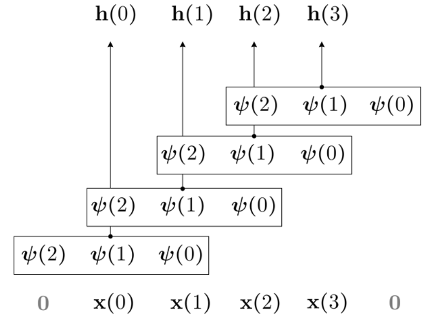

# Continuous Convolutional Neural Networks for Audio Detection and Classification

Project for Neural Networks course at Sapienza University of Rome. This project
is about the experimentation of the contributions of [[1]](#1) and [[2]](#2). The main idea is to implement a convolutional neural network architecture that uses a fully connected network to parametrize the size of the convolutional kernel itself, making the convolution in fact continuous. The main task to be solved is the detection of a whistle sound, needed for RoboCup competition.

## What is the problem with discrete convolution?

Ingredients
- We have a one-dimensional vector-valued sequence **x**$: \mathbb{R} \rightarrow \mathbb{R}^{N_{in}}$
- And a kernel function $\psi: \mathbb{R} \rightarrow \mathbb{R}^{N_{in}}$
- $N_{in}$ is the number of channels of the input sequence
- $N_{x}$ is the length of the input sequence
- $N_{k}$ is the length of the kernel

Definition of convolution (with $N_{in}=1$)
- $(x * \psi)(t) = \sum\limits_{\tau=-\frac{N_k}{2}}^{\frac{N_k}{2}} x(\tau)\cdot\psi(t-\tau)$

  

Drawbacks of this approach
- $N_k$ must be defined a priori
- No functions depending on inputs $x(t-\tau)$ for $\tau > N_k$ can be modeled (no long-range dependencies)
- Large kernels become statistically unfeasible

## Continuous Kernel Convolution

The convolution operator is now viewed as a vector-valued continuous function $\psi: \mathbb{R} \rightarrow \mathbb{R}^{N_{out} \times N_{in}}$, parametrized with a small neural network $MLP^{\psi}$
  - The input is a relative position $(t-\tau)$ of the convolvee
  - The output is the value $\psi(t-\tau)$ of the convolutional kernel at that position

Consequence: "the generated kernel is arbitrarily large"

Advantage 1: "parameterizing a convolutional kernel with a neural network is
equivalent to constructing an implicit neural representation of the kernel, with
the subtle difference that our target objective is not known a-priori, but
learned as part of the optimization task of the CNN". That means that the number
of parameters needed to represent the kernel is less than the effective
dimension of the kernel itself.

Advantage 2: The kernel can fit data of any dimensionality and resolution

Advantage 3: "CKConvs are not only more general than discrete convolutions, but
that the functional family they describe is also more general than that of
(linear) recurrent units"

### How exactly does the input go into the $MLP^{\psi}$

We give the $MLP^{\psi}$ a sequence of relative positions. This sequence can be arbitrarily big, thus also as big as the input sequence.

## Continuous Convolutional Neural Network

Continuous kernel convolutions adapt to varying input lengths and resolutions, offering several advantages in audio processing:
  - The same architecture accommodates different preprocessing techniques, such as varying sampling rates, window sizes, or feature extraction methods (e.g., STFT or MFCC). 
  - The number of parameters of the network is decoupled from its receptive field, allowing to have a long-range kernel with a relatively small number of parameters. 

### CKBlock

    input
    | ------------------|
    BatchNorm       |
    CKConv           |
    GELU               |
    DropOut           |
    Linear               |
    GELU               |
    + <---------------|
    |
    output

The CKConv layer is the core of the architecture, since it contains the kernel generation and convolution operation. 
%\paragraph{Continuous Kernel Convolution}
The convolution operation is defined as $(x * \psi)(t) = \sum\limits_{c=1}^{N_{in}} \sum\limits_{\tau=0}^{t} x_c(\tau)\cdot\psi_c(t-\tau)$, which means that the convolver is now viewed as a vector-valued continuous function
$\psi: \mathbb{R} \rightarrow \mathbb{R}^{N_{out} \times N_{in}}$,
parametrized with a small neural network $MLP^{\psi}$:
- The input is a relative position $(t-\tau)$ of the convolvee
- The output is the value $\psi(t-\tau)$ of the convolutional kernel at that position

The main consequence of this is that the kernel is arbitrarily large.

### Network Architecture

The entire network is a sequence of 4 CKBlocks, with a final fully connected
part. More specifically, the convolutional layers have a hidden size of 32. The convolutional kernels are structured as simple 3-layer MLPs with hidden size 16. I chose as kernel size 31, since an overly large kernel would overfit the training data, while a too small kernel would need a deeper network. Overall, the network size is of 59.1k trainable parameters.

### Depthwise separable continuous convolution

## Problem: Audio Event Detection

### Dataset
In addition to the task of classifying an audio sample as either whistle or no-whistle, a critical challenge in RoboCup games is ensuring accurate predictions in the presence of background noise, such as crowd sounds, robot movements, and other environmental sounds. Therefore, the dataset is a collection of audio files collected both in lab conditions and during the actual matches, using the robots' microphones. Since, on average there are few whistles in a match, the result is a heavily unbalanced dataset, with a ratio of $10:1$ (60000 no-whistle samples, 6000 whistle samples). The dataset was manually cleaned, removing many samples where the only noise source was the robot walking, or where there was silence. Also the labelling happened manually through the software Audacity by extracting the audio events, defined as start and end of the whistle, in text files. These were then associated with the corresponding audio-samples using the library librosa.

### Feature extraction
To extract the features, there is a frequency analysis of the audio signal using short-time fourier transforms. The result is, for each audio, a series of vectors of shape \verb|(1,NUMBER_FREQUENCIES)|, where each vector represents the frequency amplitudes of a window. We extracted 1024 frames per window at 44100 Hz. This resulted in every data sample being a vector of shape \verb|(1,513)|.

## References

<a id="1">[1]</a> 
[CKConv: Continuous Kernel Convolution For Sequential Data](https://arxiv.org/pdf/2102.02611)

<a id="2">[2]</a> 
[Modelling Long Range Dependencies in ND: From Task-Specific to a General Purpose CNN](https://arxiv.org/pdf/2301.10540)